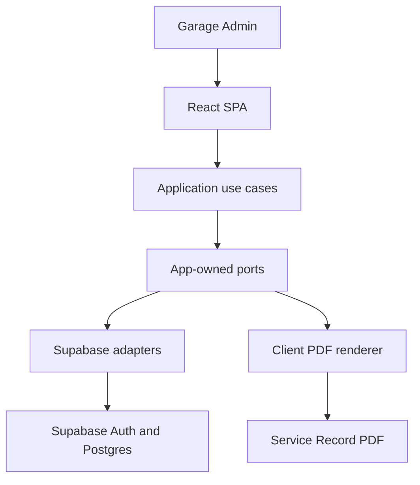
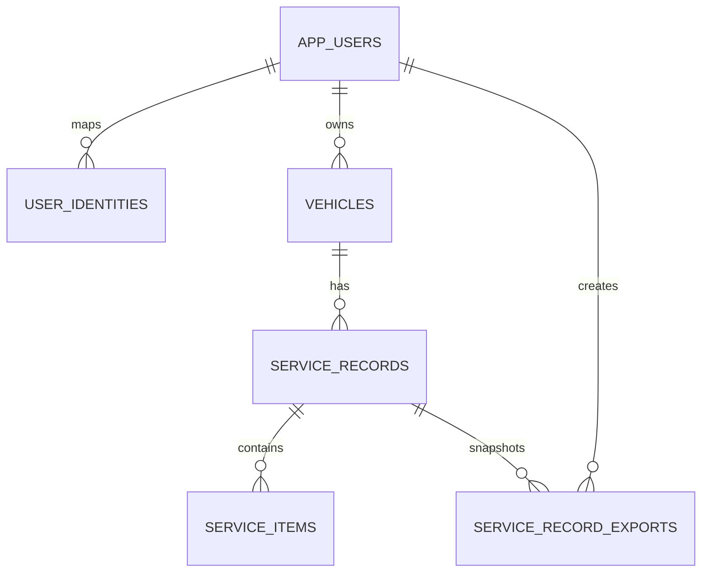
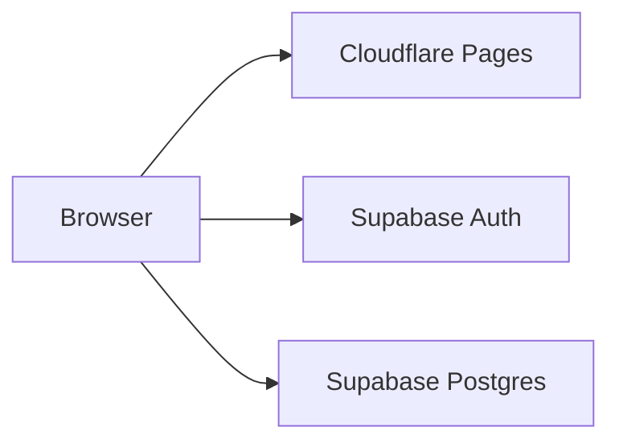
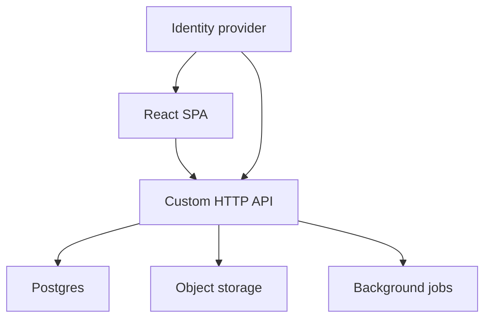

# Fullstack Garage Architecture

Status: Proposed v3
Date: 2026-07-19
Supersedes: Proposed v2
Product: [Fullstack Garage Product Scope and Language](../product/fullstack-garage-product.md)
Feature specifications: [Authentication and Access](../features/authentication-access.md), [Vehicles](../features/vehicles.md), [Service Records](../features/service-records.md)

## 1. Purpose and Scope

This document records the structural decisions for building, deploying, securing,
and evolving Fullstack Garage. It defines system boundaries, dependency direction,
technology choices, persistence relationships, transaction boundaries, security
enforcement, adapter contracts, deployment topology, and migration strategy.

This document intentionally does not define product scope, product language,
feature fields, business validation, presentation behavior, acceptance criteria,
or delivery order. Those concerns belong to the linked product and feature
documents.

## 2. Architecture Decision Summary

| ID | Decision | Rationale |
| --- | --- | --- |
| ARC-001 | Build the MVP as a React, Vite, and TypeScript SPA. | Delivers the current browser product with a small operational footprint. |
| ARC-002 | Keep domain models, use cases, and ports application-owned. | Prevents framework and vendor contracts from defining business code. |
| ARC-003 | Treat Supabase as an infrastructure adapter. | Allows later adapter replacement without rewriting feature UI or domain models. |
| ARC-004 | Separate external authentication identities from app-owned users. | Preserves stable ownership IDs across identity-provider changes. |
| ARC-005 | Enforce authorization at the database or future API boundary. | Browser checks improve UX but cannot protect data. |
| ARC-006 | Save each Service Record aggregate in one transaction. | Prevents partial records and item sets. |
| ARC-007 | Store Purchase Costs as integer minor units with a record currency. | Avoids floating-point currency errors and ambiguous mixed-currency totals. |
| ARC-008 | Generate PDFs from versioned snapshots. | Makes an export reproducible even when live Vehicle data changes. |
| ARC-009 | Manage schema, functions, and RLS through versioned migrations. | Makes every environment reproducible and reviewable. |
| ARC-010 | Replace adapters in stages when introducing a custom backend. | Separates API, database, storage, and identity migrations into reversible changes. |
| ARC-011 | Use shared repository contract tests. | Keeps Supabase and future HTTP adapters behaviorally compatible. |
| ARC-012 | Keep local, staging, and production environments isolated. | Reduces deployment risk and prevents configuration or data crossover. |

## 3. Architecture Principles

1. **Domain first:** Domain language and invariants remain independent of React,
   Supabase, transport protocols, and rendering libraries.
2. **Dependencies point inward:** Presentation and infrastructure depend on
   application-owned use cases, models, and ports.
3. **Vendors stay at the edge:** Vendor SDK types, errors, and configuration are
   mapped inside infrastructure adapters.
4. **Aggregate writes are atomic:** Multi-row business operations succeed or fail
   as one transaction.
5. **Security is server-enforced:** RLS and database functions are authoritative
   while the browser talks directly to Supabase.
6. **Exports are snapshots:** Renderers consume an immutable, versioned export
   model rather than live provider rows.
7. **Migration happens behind ports:** Replacing infrastructure must not change
   feature UI or domain contracts.
8. **Build only proven boundaries:** Do not create generic frameworks or future
   APIs before a real use case requires them.

## 4. System Context



The diagram represents logical dependencies. Application services, ports, and MVP
adapters execute in the browser, but they remain separate modules so a future HTTP
API can replace direct Supabase access at the composition root.

## 5. Technology Decisions

| Concern | MVP decision | Boundary decision |
| --- | --- | --- |
| Runtime UI | React + Vite + TypeScript | UI consumes application use cases. |
| Routing | React Router | Route definitions and return-path behavior remain presentation-owned. |
| Forms | React Hook Form + Zod when feature forms are implemented | Zod validates presentation input; domain rules remain plain TypeScript. |
| Server state | TanStack Query when remote feature state is implemented | Query hooks call repository-backed use cases. |
| Styling | Global tokens plus colocated CSS Modules | Components consume tokens from `src/styles/global.css`. |
| Backend platform | Supabase | Only infrastructure adapters access its SDK and APIs. |
| Database | PostgreSQL managed by Supabase | Prefer portable SQL and versioned migrations. |
| Authentication | Supabase Auth with Google for the MVP | Map provider subjects to app-owned users. |
| File storage | No required persisted files in the initial MVP | Introduce Supabase Storage only behind a `FileStore` port. |
| PDF rendering | Client-side renderer | Consume an app-owned `ServiceRecordSnapshot`. |
| Frontend hosting | Cloudflare Pages | Keep SPA hosting independent from data infrastructure. |
| Build runtime | Node.js 24.18.0 with npm | Versions remain locked by repository configuration. |

Dependencies are added only when their owning feature is implemented. A planned
technology choice does not require installing an unused package.

## 6. Application Boundaries

### 6.1 Layers

| Layer | Responsibility | May depend on |
| --- | --- | --- |
| Presentation | Routes, screens, forms, and display state | Application layer and UI libraries |
| Application | Use cases, orchestration, authorization-aware workflows | Domain models and ports |
| Domain | Entities, value objects, calculations, and invariants | Plain TypeScript only |
| Ports | Repository, authentication, file, clock, and PDF contracts | App-owned models |
| Infrastructure | Supabase, HTTP, storage, and renderer adapters | Ports and vendor SDKs |

### 6.2 Dependency direction

```text
React screen
  -> application use case or feature hook
    -> app-owned port
      -> selected infrastructure adapter
        -> vendor SDK or external service
```

Only the composition root selects concrete adapters. Features must not inspect
environment variables or choose between Supabase and future HTTP implementations.

Outside `src/infrastructure/supabase/`, code must not:

- Import the Supabase SDK.
- Call Supabase Auth, database, RPC, or Storage APIs.
- Return generated database-row types from application ports.
- Interpret raw Supabase errors.
- Hard-code Supabase table, function, bucket, or storage-path details.

### 6.3 Port design

Ports represent business capabilities rather than generic database access. They
return app-owned models and app-owned errors. Do not introduce an application-wide
`Repository<T>`, arbitrary filter objects, or provider query builders.

Feature specifications own exact port methods and command types. A future adapter
must implement the same behavior without changing its consumers.

## 7. Source Organization

```text
src/
  app/
    routes/
    providers/
  features/
    auth/
    vehicles/
    service-records/
  domain/
    users/
    vehicles/
    service-records/
    money/
  application/
    ports/
    use-cases/
  infrastructure/
    supabase/
      auth/
      repositories/
      storage/
      client.ts
      error-mapper.ts
    pdf/
  shared/
    components/
    config/
    formatting/
    validation/
supabase/
  migrations/
  seed.sql
```

Feature folders own React-specific screens, forms, hooks, and presentation state.
Domain and application modules must not import from `features`, `infrastructure`,
or React.

## 8. Data Architecture

### 8.1 Entity relationships



Detailed fields and feature constraints belong to the feature specifications and
versioned migrations. The architecture fixes these cross-feature relationships:

- `app_users.id` is the stable application identity and ownership key.
- External subjects exist only in `user_identities`; provider IDs never become
  domain foreign keys.
- `vehicles.owner_id` references `app_users.id`.
- Service Records carry both `vehicle_id` and `owner_id`.
- A composite relationship from `(vehicle_id, owner_id)` to the Vehicle prevents
  a Service Record from claiming a Vehicle under a different data owner.
- Service items are children of one Service Record aggregate and are authorized
  through their parent.
- Export rows reference a Service Record version and store an immutable snapshot.

### 8.2 Money and derived totals

Purchase Costs use integer minor units and an ISO 4217 currency code held at the
Service Record level. A record never mixes currencies. Mutable aggregate totals
are not persisted on the live Service Record; they are derived from items and
copied into immutable export snapshots.

### 8.3 Provider-neutral storage values

Domain models store provider-neutral IDs and storage keys, not public Supabase URLs
or SDK objects. A storage key may follow a stable convention such as
`service-records/{recordId}/{exportId}.pdf`; the `FileStore` adapter resolves it to
provider operations.

## 9. Persistence and Transaction Decisions

- Tables, constraints, indexes, RLS policies, and database functions are created
  through reviewed migrations in `supabase/migrations/`.
- Structural invariants use database constraints. Cross-row and aggregate
  invariants execute in transactional database functions for the MVP.
- Presentation validation may mirror rules for immediate feedback but is not an
  enforcement boundary.
- A Service Record and its complete ordered item set save in one transaction.
- Draft saves include the version originally loaded. Stale versions return an
  app-owned conflict rather than overwriting newer data.
- Completion validates the aggregate, allocates its display number, applies its
  Vehicle odometer decision, and increments its version in one transaction.
- Completion is idempotent: retrying a completed record returns its existing
  result instead of allocating another display number.
- Sequential display numbers are allocated inside the database transaction, never
  in browser code.

The Supabase repository calls these operations through RPC. A future backend
implements the same port behavior with a server-side transaction.

## 10. Authentication and Security Architecture

- Supabase Auth is an identity provider, not the domain user model.
- Authentication adapters map provider sessions to app-owned authentication
  states and `AppUser` models.
- RLS is enabled on every table exposed through the Supabase data API and denies
  access by default.
- Stable SQL helpers resolve the current app-user ID and role through
  `user_identities`.
- RLS policies and aggregate functions enforce the authorization behavior defined
  by the approved Authentication and Access feature.
- Browser callers never supply trusted owner IDs or roles.
- Security-definer functions use a fixed safe search path and minimum privileges.
- The SPA may contain only the public Supabase project URL and
  publishable/anonymous key. Service-role keys and provider secrets never enter
  frontend configuration, source, logs, or build output.
- Private Vehicle and Service Record values are redacted from logs and analytics
  by default.

When a custom API becomes the primary boundary, it validates the session and
enforces the same app-owned authorization rules. RLS may remain as defense in
depth.

## 11. PDF and Export Architecture

- PDF rendering is accessed through an app-owned `ServiceRecordPdfRenderer` port.
- Renderers consume a versioned `ServiceRecordSnapshot`, not provider rows or live
  queries.
- The initial MVP builds the snapshot from a completed record, renders in the
  browser, and downloads without persisted file storage.
- Snapshots contain only the data required to reproduce or explain that export,
  including the calculated total and template version.
- A future authoritative flow may create the snapshot and PDF server-side, store
  the file through `FileStore`, and persist its checksum and generation metadata.
- Client and future server renderers consume the same snapshot schema even if
  their rendering libraries differ.

## 12. Deployment Architecture

### 12.1 MVP topology



- Deploy the static SPA to Cloudflare Pages.
- Use a supported Australian Supabase region when available for the selected plan.
- Keep local, staging, and production projects and configuration separate.
- Configure explicit SPA and authentication callback URLs per environment.

### 12.2 Future backend topology



Introducing an API, moving Postgres, changing identity providers, and moving file
storage are separate decisions. They must not be combined into one irreversible
cutover.

## 13. Adapter Evolution and Backend Migration

The MVP composition root selects:

- `SupabaseAuthGateway`
- `SupabaseVehicleRepository`
- `SupabaseServiceRecordRepository`
- `ClientServiceRecordPdfRenderer`
- A `SupabaseFileStore` only when persistent storage is required

Future infrastructure may provide `HttpAuthGateway`, `HttpVehicleRepository`,
`HttpServiceRecordRepository`, a server PDF renderer, and another `FileStore`.
Adapters must satisfy the same app-owned contracts and error semantics.

Migration proceeds in reversible stages:

1. **Preserve MVP guardrails:** keep SDK access in adapters, app-owned IDs and
   contracts, migrations, RLS tests, and repository contract tests.
2. **Introduce an API without moving data:** add HTTP adapters while the API uses
   the existing Supabase Postgres database and identity during transition.
3. **Move privileged workflows:** move transactions, authoritative PDF generation,
   and background work behind the API when required.
4. **Migrate identity or storage independently:** preserve `app_users.id` and
   provider-neutral storage keys during any provider change.
5. **Move Postgres only when justified:** rehearse the migration, verify schema and
   data, run contract suites, and retain a tested rollback window.

A custom API becomes justified when browser execution cannot safely support a
required privileged operation, background work or integrations need secrets,
multi-user authorization becomes materially more complex, an authoritative
server export is required, or database RPCs accumulate excessive workflow logic.

## 14. Architectural Verification

- Unit tests verify domain calculations, invariants, and provider-to-domain
  mappings.
- Each repository and authentication port has a shared contract suite that every
  adapter must pass.
- Integration tests verify migrations from an empty database, RLS denial and
  permitted access, transactional functions, concurrency, and rollback.
- End-to-end tests cover critical flows across routing, authentication,
  persistence, and PDF rendering.
- Feature specifications own detailed behavioral test cases.

The adapter boundary is considered replaceable only when both the current and
replacement implementations pass the same contract suite.

## 15. Delivery and Operations Decisions

- Run formatting, type checking, tests, migration reset, and production build in
  CI.
- Generate database client types as a deliberate build step and map them only
  inside Supabase adapters.
- Document environment variables in `.env.example` without secrets.
- Apply production schema changes only through reviewed migrations.
- Create and verify a logical database export before risky schema releases.
- Back up object storage separately because database backups contain storage
  metadata, not necessarily stored files.
- Use structured app-owned errors and privacy-safe logging.

## 16. Primary References

- Supabase local development and migrations: https://supabase.com/docs/guides/local-development/overview
- Supabase database migrations: https://supabase.com/docs/guides/deployment/database-migrations
- Supabase database backups: https://supabase.com/docs/guides/platform/backups
- Supabase backup and restore: https://supabase.com/docs/guides/platform/migrating-within-supabase/backup-restore
- Cloudflare Pages React deployment: https://developers.cloudflare.com/pages/framework-guides/deploy-a-react-site/
- Cloudflare Pages SPA routing: https://developers.cloudflare.com/pages/configuration/serving-pages/
