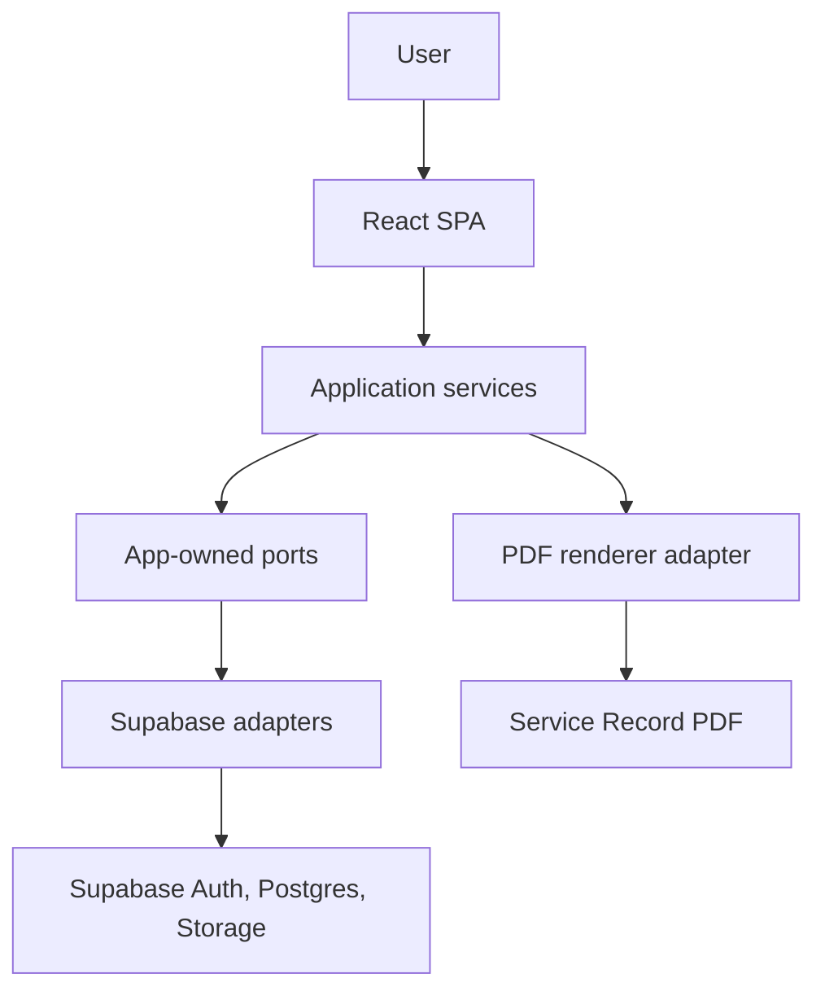
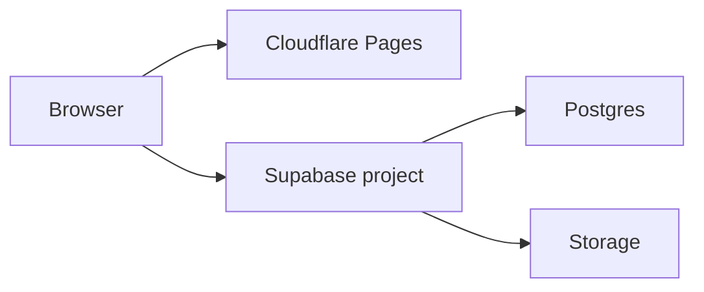
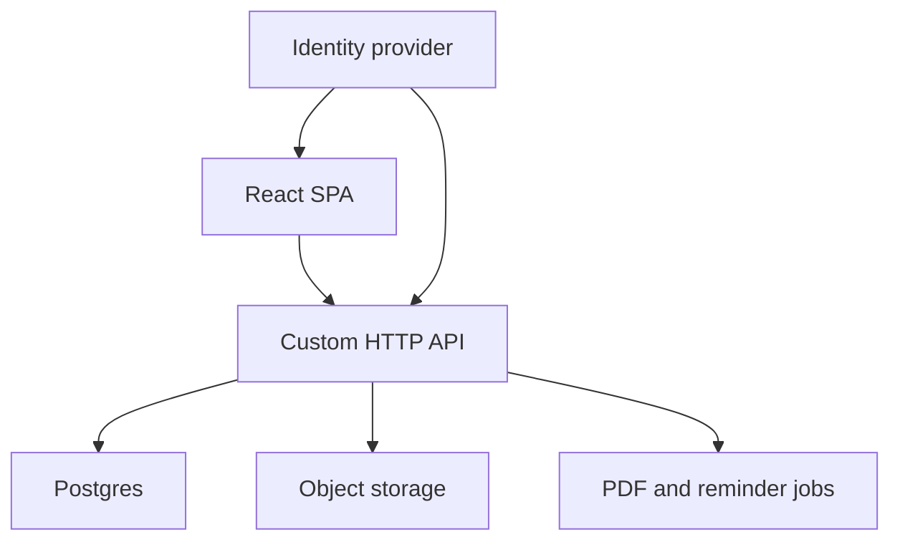

# Fullstack Garage Architecture

Status: Proposed v2  
Date: 2026-07-17  
Supersedes: Draft v1  
Feature name locked: Service Record

## 1. Purpose

Fullstack Garage is a single-page web application for recording vehicle maintenance history and producing branded Service Record PDFs.

A Service Record is not an invoice. It records maintenance performed, parts and consumables used, and the actual purchase cost of those items. The product must not imply that money is owed or that a commercial workshop service was provided.

The MVP will use Supabase to reduce initial infrastructure work. It must nevertheless be structured so a custom backend can be introduced without rewriting the user interface or redesigning the core data model.

## 2. Changes From v1

This version keeps the v1 product direction and adds the following architecture requirements:

1. Application-owned domain models and repository interfaces are mandatory.
2. Supabase is an infrastructure adapter, not the application's public API.
3. Multi-table Service Record writes use one transactional database operation.
4. Database schema and policies are managed as versioned migrations in source control.
5. Authentication identities are separated from application users to reduce provider lock-in.
6. Monetary values use integer minor units and an ISO currency code.
7. PDF exports are versioned snapshots rather than pointers to changing live data.
8. Repository contract tests make a later HTTP backend adapter replaceable with confidence.
9. The migration to a custom backend is divided into reversible stages.

## 3. Product Scope

### 3.1 MVP capabilities

The MVP should allow a user to:

1. Create an account and sign in.
2. Add and manage one or more vehicles.
3. Create and edit a Service Record for a vehicle.
4. Add parts, fluids, consumables, inspections, and custom service items.
5. Record the actual purchase cost of each item.
6. View a vehicle's service history.
7. Preview and download a branded Service Record PDF.
8. Use the application on mobile and desktop.

### 3.2 Explicit non-goals

The MVP does not include:

- Invoices, payments, tax, GST, or amounts due.
- Workshop bookings or customer management.
- Labour pricing.
- Public marketplaces.
- Native mobile applications.
- Automated reminders.
- Receipt OCR.
- Multi-tenant business accounts.

### 3.3 Naming rules

Use:

- Service Record
- Vehicle Service History
- Parts & Consumables
- Purchase Cost
- Total Parts & Consumables
- Performed By
- Next Service Due

Avoid:

- Invoice
- Amount Due or Total Due
- Tax, GST, or ABN
- Payment Status
- Customer Balance
- Labour Charge

Labour may appear only as descriptive text such as `Personal maintenance` or `Labour not charged`.

## 4. Architecture Principles

1. **Domain first:** Business language and rules belong to Fullstack Garage, not Supabase, React, or a PDF library.
2. **Dependencies point inward:** UI and use cases depend on app-owned interfaces. Infrastructure implements those interfaces.
3. **Supabase stays at the edge:** Only adapter modules may import the Supabase SDK or use Supabase table, RPC, bucket, and error types.
4. **Aggregate writes are atomic:** Saving a Service Record and its items must succeed or fail as one transaction.
5. **The database is reproducible:** Tables, constraints, indexes, functions, and RLS policies live in reviewed migration files.
6. **Security is server-enforced:** Frontend checks improve usability; database policies and backend authorization provide protection.
7. **Exports are snapshots:** A generated PDF represents a specific record version and template version.
8. **Migration happens by adapter replacement:** A future backend is introduced behind existing application interfaces.
9. **Build only proven needs:** Interfaces should support current use cases, not speculative generic frameworks.

## 5. System Context



The diagram shows logical dependencies, not separate deployed services. During the MVP, application services, repository interfaces, and Supabase adapters all run in the SPA. This separation is still valuable because it defines the boundary a future backend will replace.

## 6. Technology Decisions

| Layer | MVP choice | Portability decision |
| --- | --- | --- |
| Frontend | React + Vite + TypeScript | UI depends on application services, not Supabase |
| Routing | React Router | Route definitions remain frontend-owned |
| Forms and validation | React Hook Form + Zod | Reuse Zod schemas only at frontend boundaries; domain rules remain plain TypeScript |
| Server state | TanStack Query | Query keys and hooks call repository-backed use cases |
| Styling | CSS Modules or Tailwind CSS | Keep brand tokens in app-owned configuration |
| Backend platform | Supabase | Access only through infrastructure adapters |
| Database | PostgreSQL managed by Supabase | Prefer portable SQL and versioned migrations |
| Authentication | Supabase Auth | Map provider identities to app-owned users |
| File storage | Supabase Storage when persisted exports are introduced | Access through a `FileStore` port |
| PDF | Client-side renderer for MVP download | Access through a `ServiceRecordPdfRenderer` port |
| Frontend hosting | Cloudflare Pages | Static SPA can move to another host independently |

Choose one styling approach during project setup. Do not install both Tailwind CSS and CSS Modules as competing application-wide systems.

## 7. Deployment Topology

### 7.1 MVP



- Deploy the static SPA to Cloudflare Pages.
- Select the Supabase Sydney region when it is available for the chosen plan.
- Use separate local, staging, and production configurations.
- Only the public Supabase URL and publishable/anonymous key may be exposed to the browser.
- A Supabase service-role key must never be included in the SPA or frontend build environment.

### 7.2 Future custom backend



The custom backend may initially use the existing Supabase Postgres database. Introducing an API and moving the database are separate decisions and should not happen in one release.

## 8. Application Boundaries

### 8.1 Layers

| Layer | Responsibility | May depend on |
| --- | --- | --- |
| Presentation | Routes, screens, forms, display state | Application layer and UI libraries |
| Application | Use cases, orchestration, authorization-aware workflows | Domain and port interfaces |
| Domain | Entities, value objects, calculations, invariants | Plain TypeScript only |
| Ports | Repository, identity, file, clock, and PDF interfaces | App-owned models |
| Infrastructure | Supabase, HTTP, storage, and PDF library adapters | Ports and vendor SDKs |

### 8.2 Required dependency direction

```text
React screen
  -> application use case or feature hook
    -> app-owned repository interface
      -> Supabase repository adapter
        -> Supabase client
```

Forbidden outside `infrastructure/supabase`:

- Importing `@supabase/supabase-js`.
- Calling `supabase.from(...)`, `supabase.rpc(...)`, Auth, or Storage APIs.
- Returning generated Supabase database types from repositories.
- Checking raw Supabase error codes in components.
- Hard-coding table names, bucket names, or storage paths.

### 8.3 Repository shape

Repositories should represent business operations, not expose a generic database wrapper.

```ts
export interface ServiceRecordRepository {
  getById(id: ServiceRecordId): Promise<ServiceRecord | null>;
  listForVehicle(vehicleId: VehicleId): Promise<ServiceRecordSummary[]>;
  saveDraft(input: SaveServiceRecordDraft): Promise<ServiceRecord>;
  complete(id: ServiceRecordId, expectedVersion: number): Promise<ServiceRecord>;
}
```

Do not create an application-wide generic `Repository<T>` or allow arbitrary filter objects. These abstractions usually leak database behavior and make a future HTTP API harder to design.

### 8.4 Transaction boundary

A Service Record and its items form one aggregate. `saveDraft` must persist the record and its current item set in one transaction. Updates must include the version originally loaded by the user. If that version is no longer current, return an app-owned conflict error instead of overwriting newer data.

For the Supabase adapter, implement this operation as a PostgreSQL function called through RPC rather than several independent browser requests. Validate ownership, expected version, and inputs inside the transaction. Completion must be idempotent: retrying an already completed record returns its existing display number instead of allocating another one. A future backend will implement the same repository operation using a server-side database transaction.

## 9. Suggested Source Structure

```text
src/
  app/
    routes/
    providers/
  features/
    auth/
    vehicles/
    service-records/
  domain/
    users/
    vehicles/
    service-records/
    money/
  application/
    ports/
    use-cases/
  infrastructure/
    supabase/
      auth/
      repositories/
      storage/
      client.ts
      error-mapper.ts
    pdf/
  shared/
    components/
    config/
    formatting/
    validation/
supabase/
  migrations/
  seed.sql
```

Feature folders may contain feature-specific hooks, forms, and screens. Domain and application modules must not import from `features`, `infrastructure`, or React.

## 10. Domain Model

### 10.1 Application user and identity

Use an app-owned user ID rather than treating a Supabase Auth user object as the domain user.

`app_users`:

- `id uuid primary key`
- `display_name text`
- `created_at timestamptz`
- `updated_at timestamptz`

`user_identities`:

- `id uuid primary key`
- `user_id uuid references app_users`
- `provider text`
- `provider_subject text`
- `created_at timestamptz`
- unique `(provider, provider_subject)`

For the MVP, `provider` is `supabase` and `provider_subject` contains the Supabase Auth user ID. A database trigger or a controlled onboarding function creates both records. A future identity provider can add a new mapping without changing vehicle ownership IDs.

### 10.2 Vehicles

`vehicles`:

- `id uuid primary key`
- `owner_id uuid references app_users`
- `make text not null`
- `model text not null`
- `year smallint`
- `registration text`
- `vin text`
- `current_odometer integer`
- `engine text`
- `notes text`
- `created_at timestamptz`
- `updated_at timestamptz`

Validation and constraints:

- `year` must be within a reasonable configured range.
- `current_odometer` must be zero or greater.
- Registration and VIN are optional and should not be globally unique.
- Index `owner_id` for owner-scoped lists.

### 10.3 Service Records

`service_records`:

- `id uuid primary key`
- `owner_id uuid references app_users`
- `vehicle_id uuid`
- `display_number text`
- `status text check in ('draft', 'completed')`
- `service_date date not null`
- `odometer integer not null`
- `performed_by text`
- `location text`
- `summary text`
- `notes text`
- `next_service_due_date date`
- `next_service_due_odometer integer`
- `currency_code char(3) default 'AUD'`
- `version integer default 1`
- `created_at timestamptz`
- `updated_at timestamptz`

Use a composite foreign key from `(vehicle_id, owner_id)` to `vehicles(id, owner_id)` so a record cannot claim another user's vehicle. Add a unique constraint for `(owner_id, display_number)` when the number is present.

`display_number` is assigned once by a database function when the record is completed. Do not generate sequential display numbers in browser code because concurrent requests can collide. Internal references use the UUID, not the display number.

### 10.4 Service Items

`service_items`:

- `id uuid primary key`
- `service_record_id uuid references service_records on delete cascade`
- `kind text check in ('part', 'fluid', 'consumable', 'inspection', 'other')`
- `category text`
- `name text not null`
- `brand text`
- `specification text`
- `part_number text`
- `supplier text`
- `quantity numeric(12,3)`
- `unit text`
- `purchase_cost_minor bigint`
- `notes text`
- `sort_order integer`
- `created_at timestamptz`
- `updated_at timestamptz`

`purchase_cost_minor` is the total actual purchase cost for that line, stored in the smallest currency unit. For AUD, `7299` means `$72.99`. Quantity describes the purchased or used item and does not multiply the cost automatically in the MVP.

Inspections and notes may have a null purchase cost. A provided cost must be zero or greater.

### 10.5 Totals

Do not persist a mutable `total_parts_cost` on `service_records`. Calculate it from the current items in a query/view or application domain function. This avoids totals drifting from their item rows.

When a PDF export is created, store the calculated total inside that immutable export snapshot.

### 10.6 Export snapshots

Persisted PDF exports are optional for the first downloadable MVP but the model should be defined now.

`service_record_exports`:

- `id uuid primary key`
- `service_record_id uuid references service_records`
- `record_version integer`
- `template_version text`
- `snapshot jsonb`
- `storage_key text`
- `sha256 text`
- `generated_at timestamptz`
- `created_by uuid references app_users`

The snapshot contains only data required to reproduce or explain that export. It must not be silently updated when the live Service Record changes. Storage keys are provider-neutral values such as `service-records/{recordId}/{exportId}.pdf`; public provider URLs must not be stored as domain data.

## 11. Security and Authorization

Enable Row Level Security on every table exposed through Supabase's data API. Deny access by default and add the minimum policies required for authenticated users.

Create a stable SQL helper such as `current_app_user_id()` that resolves the active Supabase identity through `user_identities`. Policies can then be expressed using application user IDs rather than repeating provider-specific lookups.

Required behavior:

- Users may read and update only their own app-user profile.
- Users may create, read, update, and delete only their own vehicles.
- Users may access Service Records only when `owner_id` matches the current app user.
- Service item access must be authorized through the parent Service Record.
- Export metadata and stored files must be restricted through the parent record.
- Completion, record-number allocation, and aggregate saves must verify ownership inside their database functions.

Test RLS using at least two users. Each policy test should prove allowed access for the owner and denied access for another authenticated user and an unauthenticated user.

Treat registration, VIN, location, notes, and receipts as private data. Do not include them in logs or analytics payloads by default.

## 12. PDF Architecture

Define an app-owned interface:

```ts
export interface ServiceRecordPdfRenderer {
  render(snapshot: ServiceRecordSnapshot): Promise<Blob>;
}
```

MVP flow:

1. Load a complete saved Service Record through the repository.
2. Convert it to a versioned `ServiceRecordSnapshot`.
3. Render a PDF in the browser.
4. Download it without requiring file storage.

The snapshot should include:

- Snapshot schema version.
- Service Record UUID, display number, and version.
- Vehicle and service details.
- Ordered item rows and calculated total.
- Currency code.
- Brand and PDF template version.
- Generation timestamp.

Future authoritative export flow:

1. The custom backend or server function reads the record in a transaction.
2. It creates the immutable snapshot.
3. A server-side renderer creates the PDF.
4. The file is stored through the `FileStore` adapter.
5. Export metadata and checksum are saved.

Client-generated and server-generated renderers should consume the same snapshot schema even if they use different PDF libraries.

## 13. Validation and Business Rules

- Vehicle make and model are required.
- Service date is required.
- Odometer values must be zero or greater.
- The Service Record odometer should not silently reduce the vehicle's current odometer; require confirmation or leave the vehicle value unchanged.
- A completed record must contain a summary or at least one service item.
- Service item name is required.
- Quantity, when present, must be greater than zero.
- Purchase cost, when present, must be zero or greater.
- Currency is set at Service Record level; all item costs inherit it.
- Next-service odometer should be greater than the service odometer when supplied.
- Record completion assigns the immutable display number.
- Every update increments the Service Record version.
- Updates with a stale expected version fail with a conflict instead of silently overwriting data.

Enforce structural rules with database constraints. Enforce multi-row rules in transactional database functions or, later, backend use cases. Mirror relevant rules in frontend forms for immediate feedback.

## 14. API Evolution

### 14.1 MVP repository adapters

- `SupabaseAuthGateway`
- `SupabaseVehicleRepository`
- `SupabaseServiceRecordRepository`
- `SupabaseFileStore`
- `ClientServiceRecordPdfRenderer`

### 14.2 Future HTTP adapters

- `HttpAuthGateway` or a provider-specific identity adapter
- `HttpVehicleRepository`
- `HttpServiceRecordRepository`
- `HttpFileStore`

Both repository families must return the same application-owned models and errors. The frontend selects implementations in one composition-root module. Do not scatter environment checks through features.

Suggested future API resources:

```text
GET    /v1/vehicles
POST   /v1/vehicles
GET    /v1/vehicles/{vehicleId}
PATCH  /v1/vehicles/{vehicleId}
GET    /v1/vehicles/{vehicleId}/service-records
POST   /v1/service-records
GET    /v1/service-records/{recordId}
PUT    /v1/service-records/{recordId}/draft
POST   /v1/service-records/{recordId}/complete
POST   /v1/service-records/{recordId}/exports
```

These routes are a direction, not an MVP implementation requirement. Define the final HTTP contract when the backend is introduced, based on actual use cases and repository contracts.

## 15. Migration Plan to a Custom Backend

### Stage 0: MVP portability guardrails

- Keep all Supabase SDK access in adapters.
- Commit SQL migrations, RLS policies, functions, and seed data.
- Use app-owned IDs, models, errors, and repository interfaces.
- Add repository contract tests and RLS integration tests.
- Maintain regular logical database exports, especially on plans without managed daily backups.

### Stage 1: Introduce the API without moving data

- Build a small Node.js or .NET HTTP API.
- Keep the existing Supabase Postgres database.
- Validate Supabase-issued access tokens in the API during transition.
- Implement the existing repository operations as API endpoints.
- Add `Http*Repository` adapters to the SPA.
- Switch one low-risk feature at a time using configuration.

### Stage 2: Move privileged workflows

- Move PDF generation, share links, email, reminders, and imports to the backend.
- Replace browser RPC calls with backend transactions.
- Keep RLS as defense in depth while direct browser access is being removed.

### Stage 3: Migrate authentication and storage if needed

- Add new provider subjects to `user_identities` while preserving `app_users.id`.
- Require users to establish credentials with the new provider through a secure account migration flow.
- Copy stored files and verify counts and checksums before switching the `FileStore` adapter.

### Stage 4: Move Postgres only if justified

- Rehearse migration in staging using logical dump/restore or replication.
- Verify schema, extensions, row counts, constraints, functions, and data checksums.
- Run both repository contract and end-to-end tests against the target environment.
- Schedule a controlled write freeze or replication cutover.
- Keep a tested rollback window.

The likely first meaning of a "real backend" is Stage 1, not Stage 4. A custom API can deliver server-side control while Supabase continues to operate Postgres, Auth, or Storage.

## 16. When to Introduce the Custom Backend

Introduce the custom API when at least one of these becomes a real requirement:

- Privileged operations cannot safely run from the browser.
- Multi-user sharing or roles become more complex than owner-only RLS.
- Background jobs, reminders, email, or queues are needed.
- External integrations require secrets.
- Server-generated authoritative PDFs are required.
- Rate limiting, audit trails, or public APIs are needed.
- Database RPC functions are accumulating application workflow logic.

Do not introduce it only to make the architecture look more enterprise. The adapter boundaries, tests, and migrations give the MVP room to grow until server ownership provides concrete value.

## 17. Testing Strategy

### Unit tests

- Money formatting and totals.
- Service Record validation and versioning.
- Snapshot creation.
- Mapping between Supabase rows and domain models.

### Repository contract tests

Define behavior tests once and run them against each repository implementation:

- Create, read, update, list, and delete vehicles.
- Save a complete Service Record aggregate atomically.
- Preserve item order.
- Enforce ownership failures.
- Return app-owned not-found, validation, conflict, and unauthorized errors.

Run these tests against Supabase locally. Later, run the same suite against HTTP adapters in a test environment.

### Integration and end-to-end tests

- RLS policies with owner, other user, and anonymous sessions.
- Database functions and migration reset from an empty database.
- Sign-in, vehicle creation, Service Record creation, and PDF download.
- PDF smoke checks for required text, totals, and page count.

## 18. Delivery and Operations

- Keep `local`, `staging`, and `production` environments separate.
- Apply database changes through migrations, not manual production dashboard edits.
- Run formatting, type checking, unit tests, migration reset, and build checks in CI.
- Generate database client types in CI or as a deliberate build step, but map them inside adapters.
- Use structured application errors and redact private vehicle data from logs.
- Document environment variables in `.env.example` without secrets.
- Before risky schema releases, create and verify a logical database export.
- Back up object storage separately; database backups contain storage metadata, not necessarily the stored objects.

## 19. Recommended Build Order

1. Create the repository, React application, routing, and brand tokens.
2. Add domain models, application ports, error types, and composition root.
3. Initialize Supabase local development and commit the first schema migration.
4. Implement application-user identity mapping and RLS policies.
5. Implement Supabase adapters and repository contract tests.
6. Build authentication screens and session handling.
7. Build vehicle management.
8. Build transactional Service Record draft saving and completion.
9. Build the ordered service-item editor and cost totals.
10. Build the snapshot mapper and client PDF renderer.
11. Add end-to-end tests for the primary workflow.
12. Deploy staging, verify auth/RLS/deep links/PDF output, then deploy production.

## 20. Architecture Decision Summary

- Build the MVP as a React + Vite + TypeScript SPA hosted on Cloudflare Pages.
- Use Supabase Auth, Postgres, and later Storage in the Sydney region when available.
- Use Supabase behind a small data-access and infrastructure layer, never directly from UI or domain code.
- Model Service Record writes as atomic aggregate operations.
- Store money in integer minor units with a record-level currency code.
- Calculate live totals from items and preserve export totals in immutable snapshots.
- Keep schema, database functions, and RLS policies in source-controlled migrations.
- Use app-owned users and identity mappings to reduce authentication lock-in.
- Use repository contract tests to protect the future Supabase-to-HTTP adapter replacement.
- Introduce a custom backend in stages, initially against the existing Supabase Postgres database.
- Keep Service Records clearly separate from invoices and commercial billing.

## 21. Primary References

- Supabase local development and migrations: https://supabase.com/docs/guides/local-development/overview
- Supabase database migrations: https://supabase.com/docs/guides/deployment/database-migrations
- Supabase database overview: https://supabase.com/docs/guides/database/overview
- Supabase database backups: https://supabase.com/docs/guides/platform/backups
- Supabase backup and restore: https://supabase.com/docs/guides/platform/migrating-within-supabase/backup-restore
- Cloudflare Pages React deployment: https://developers.cloudflare.com/pages/framework-guides/deploy-a-react-site/
- Cloudflare Pages SPA routing: https://developers.cloudflare.com/pages/configuration/serving-pages/
